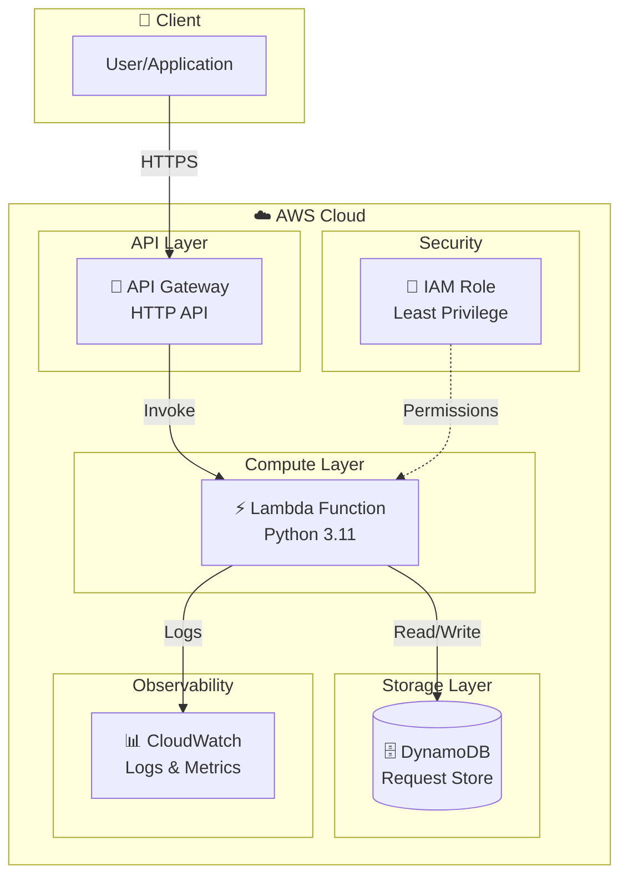
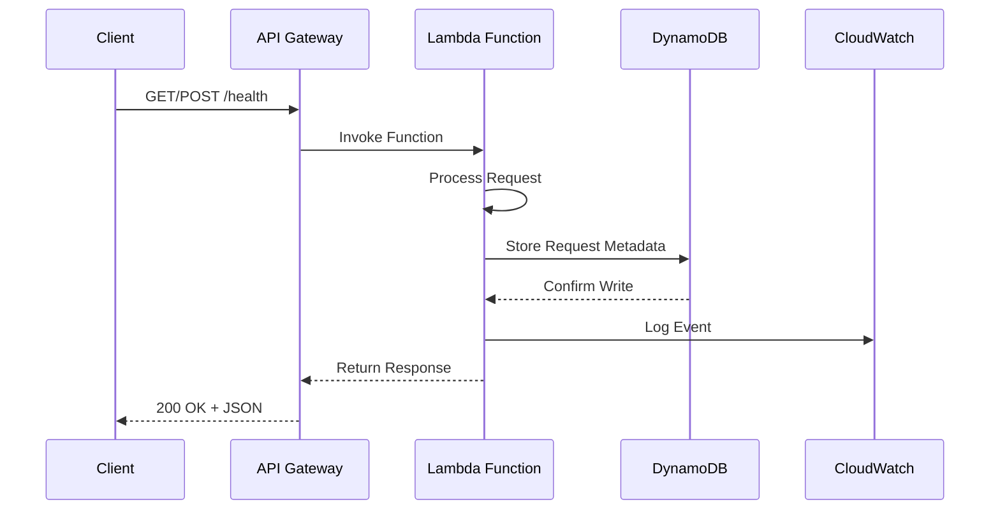
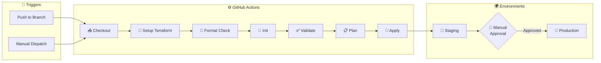

<div id="top"></div>

<!-- HEADER STYLE: CLASSIC CLEAN -->
<div align="center">


<h1>⚡ Serverless Health Check API</h1>

<em>Ensure System Uptime, Instantly and Reliably</em>

<br><br>

<!-- REPO BADGES -->
<p>
  
  
  
  
</p>

<p>
  
  
  
</p>

<br>

<!-- TOOLS & TECH STACK -->
<p>
  
  
  
  
  
</p>

<p>
  
  
  
  
</p>

<p>
  <strong>A production-ready serverless health check API with complete CI/CD pipeline</strong>
</p>

<p>
  <a href="#-architecture">Architecture</a> •
  <a href="#-quick-start">Quick Start</a> •
  <a href="#-cicd-pipeline">CI/CD</a> •
  <a href="#-testing-the-api">Testing</a> •
  <a href="#-deployment">Deployment</a>
</p>

</div>

---

## 🎯 Overview

A staging & production-ready serverless health check API built with AWS Lambda, API Gateway, and DynamoDB. Features a complete CI/CD pipeline using Terraform and GitHub Actions for multi-environment deployments.

### ✨ Features

- ✅ **Multi-environment support** (staging & production)
- ✅ **Infrastructure as Code** with Terraform modules
- ✅ **Automated CI/CD** with GitHub Actions
- ✅ **State locking** with DynamoDB
- ✅ **Environment-specific configurations**
- ✅ **Automated Lambda packaging**
- ✅ **Least-privilege IAM policies**
- ✅ **CloudWatch monitoring**

---

## 🏗️ Architecture



### Request Flow



### Components

| Component | Technology | Purpose |
|-----------|------------|---------|
| **API Gateway** | HTTP API (v2) | Serverless REST API with `/health` endpoint |
| **Lambda** | Python 3.11 | Process health checks and store data |
| **DynamoDB** | On-Demand | NoSQL database for request metadata |
| **CloudWatch** | Logs | Centralized logging with 7-day retention |
| **IAM** | Roles & Policies | Least-privilege security |
| **S3 + DynamoDB** | State Backend | Terraform state management with locking |

---

## 🔄 CI/CD Pipeline



### Workflow Triggers

| Trigger | Action |
|---------|--------|
| Push to `staging` | Auto-deploy to staging |
| Push to `main` | Deploy staging → approval → production |
| Manual dispatch | Deploy specific environment on-demand |

### Multi-Environment Setup

| Environment | Branch | Auto-Deploy | Approval Required |
|-------------|--------|-------------|-------------------|
| 🧪 Staging | `staging` | ✅ Yes | ❌ No |
| 🚀 Production | `main` | ✅ Yes | ✅ Yes |

---

## 📋 Prerequisites

### Required

- **AWS Account** with programmatic access
- **GitHub Account** for repository and Actions
- **Terraform** >= 1.6.0 (for local development)
- **Python** 3.11+ (for local Lambda testing)

### GitHub Secrets Configuration

Configure in `Settings` → `Secrets and variables` → `Actions`:

| Secret | Description |
|--------|-------------|
| `AWS_ACCESS_KEY_ID` | Your AWS access key |
| `AWS_SECRET_ACCESS_KEY` | Your AWS secret access key |

---

## 🚀 Quick Start

### 1. Clone the Repository

```bash
git clone https://github.com/lloredia/serverless-health-check.git
cd serverless-health-check
```

### 2. Set Up S3 Backend (One-time Setup)

```bash
# Create S3 bucket for state
aws s3api create-bucket \
  --bucket <your-unique-bucket-name> \
  --region us-east-1

# Enable versioning
aws s3api put-bucket-versioning \
  --bucket <your-unique-bucket-name> \
  --versioning-configuration Status=Enabled

# Create DynamoDB table for state locking
aws dynamodb create-table \
  --table-name terraform-state-lock \
  --attribute-definitions AttributeName=LockID,AttributeType=S \
  --key-schema AttributeName=LockID,KeyType=HASH \
  --billing-mode PAY_PER_REQUEST \
  --region us-east-1
```

### 3. Deploy via GitHub Actions

**Deploy to Staging:**
```bash
git checkout -b staging
git push origin staging
```

**Deploy to Production:**
```bash
git checkout main
git merge staging
git push origin main
```

### 4. Local Development (Optional)

```bash
cd terraform
terraform init
terraform plan -var-file="environments/staging.tfvars"
terraform apply -var-file="environments/staging.tfvars"
terraform output
```

---

## 📁 Project Structure

```
serverless-health-check/
├── .github/
│   └── workflows/
│       └── deploy.yml              # CI/CD pipeline
├── lambda/
│   ├── health_check.py             # Lambda function code
│   └── requirements.txt            # Python dependencies
├── terraform/
│   ├── modules/
│   │   ├── api-gateway/           # API Gateway module
│   │   ├── dynamodb/              # DynamoDB module
│   │   └── lambda/                # Lambda module
│   ├── environments/
│   │   ├── staging.tfvars         # Staging variables
│   │   └── prod.tfvars            # Production variables
│   ├── backend.tf                 # S3 backend configuration
│   ├── main.tf                    # Root module
│   ├── variables.tf               # Root variables
│   ├── outputs.tf                 # Root outputs
│   └── providers.tf               # AWS provider config
├── docs/
│   └── logo.svg                   # Project logo
└── README.md
```

---

## 🧪 Testing the API

### Get Your API Endpoint

```bash
cd terraform
terraform output api_endpoint
```

### Health Check Endpoints

**GET Request:**
```bash
curl https://your-api-id.execute-api.us-east-1.amazonaws.com/health
```

**POST Request:**
```bash
curl -X POST https://your-api-id.execute-api.us-east-1.amazonaws.com/health \
  -H "Content-Type: application/json" \
  -d '{"test": "data", "source": "manual"}'
```

### Expected Response

```json
{
  "statusCode": 200,
  "body": {
    "status": "healthy",
    "message": "Request processed and saved.",
    "request_id": "123e4567-e89b-12d3-a456-426614174000",
    "timestamp": "2025-01-01T12:00:00.000Z"
  }
}
```

### Verify DynamoDB Records

```bash
aws dynamodb scan \
  --table-name staging-requests-db \
  --region us-east-1 \
  --output table
```

---

## ⚙️ Configuration

### Environment Variables

| Variable | Description | Example |
|----------|-------------|---------|
| `environment` | Environment name | `staging` or `prod` |
| `aws_region` | AWS region | `us-east-1` |
| `table_name` | DynamoDB table name | `staging-requests-db` |

### Lambda Configuration

| Setting | Value |
|---------|-------|
| Runtime | Python 3.11 |
| Memory | 128 MB |
| Timeout | 30 seconds |
| Billing | On-Demand |

### Resource Naming Convention

| Resource | Staging | Production |
|----------|---------|------------|
| Lambda Function | `staging-health-check-function` | `prod-health-check-function` |
| DynamoDB Table | `staging-requests-db` | `prod-requests-db` |
| IAM Role | `staging-health-check-function-role` | `prod-health-check-function-role` |

---

## 🛠️ Common Operations

### Import Existing Resources

```bash
cd terraform

# Import DynamoDB table
terraform import \
  -var-file="environments/staging.tfvars" \
  module.dynamodb.aws_dynamodb_table.requests \
  staging-requests-db

# Import IAM role
terraform import \
  -var-file="environments/staging.tfvars" \
  module.lambda.aws_iam_role.lambda \
  staging-health-check-function-role
```

### Destroy Resources

```bash
cd terraform
terraform destroy -var-file="environments/staging.tfvars"
```

---

## 🔍 Troubleshooting

### State Lock Error

```bash
aws dynamodb delete-item \
  --table-name terraform-state-lock \
  --key '{"LockID":{"S":"<your-state-path>"}}' \
  --region us-east-1
```

### Lambda Function Fails

```bash
# Check CloudWatch logs
aws logs tail /aws/lambda/staging-health-check-function --follow

# Test function directly
aws lambda invoke \
  --function-name staging-health-check-function \
  --payload '{"test": "data"}' \
  response.json
```

---

## 🔐 Security Best Practices

- ✅ IAM roles follow least-privilege principle
- ✅ No hardcoded credentials in code
- ✅ Secrets stored in GitHub Secrets
- ✅ HTTPS-only API endpoints
- ✅ CloudWatch logs for audit trail
- ⚠️ **TODO**: Add API authentication (API keys/Cognito)
- ⚠️ **TODO**: Enable AWS WAF for DDoS protection

---

## 💡 Design Decisions

| Decision | Choice | Why |
|----------|--------|-----|
| API Type | HTTP API (v2) | Lower cost, simpler config |
| DynamoDB Billing | PAY_PER_REQUEST | Cost-effective for variable traffic |
| Terraform Structure | Modular | Reusability, maintainability |
| CI/CD | GitHub Actions | Native integration, free for public repos |

---

## 🚧 Future Enhancements

- [ ] Add API authentication (API keys or AWS Cognito)
- [ ] Implement request rate limiting
- [ ] Add custom domain name with ACM certificate
- [ ] Implement blue-green deployments
- [ ] Add integration tests in CI/CD pipeline
- [ ] Set up CloudWatch alarms and SNS notifications
- [ ] Add AWS WAF for security
- [ ] Implement multi-region deployment

---

## 📄 License

MIT License — see [LICENSE](LICENSE) for details.

---

<p align="center">
  <strong>Built with ❤️ by <a href="https://github.com/lloredia">Lesley Oredia</a></strong>
</p>

<p align="center">
  <em>AWS Lambda • API Gateway • DynamoDB • Terraform • GitHub Actions</em>
</p>
