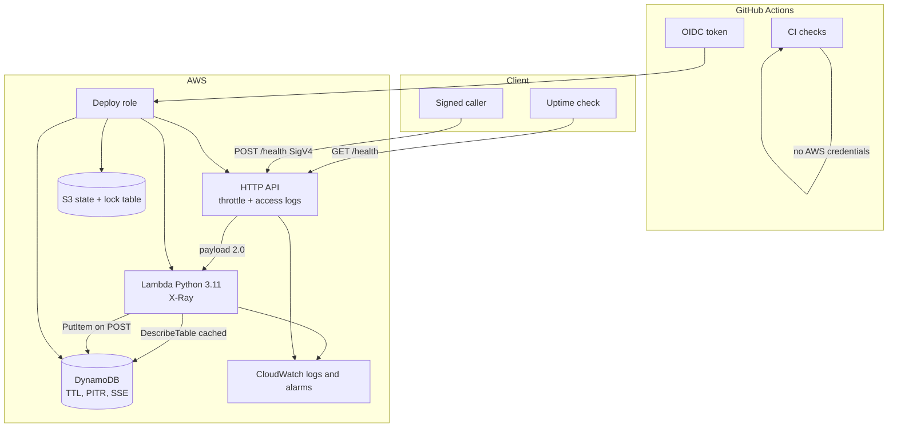
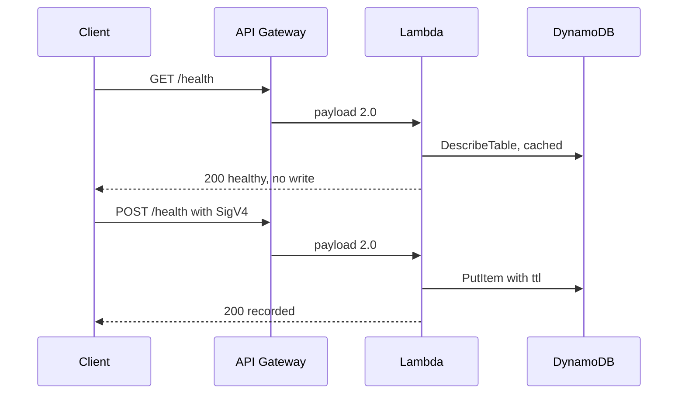
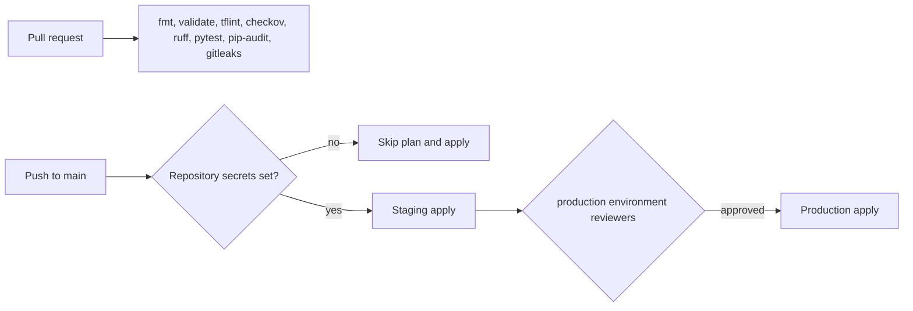

<div id="top"></div>

<!-- HEADER STYLE: CLASSIC CLEAN -->
<div align="center">


<h1>⚡ Serverless Health Check API</h1>

<em>Ensure System Uptime, Instantly and Reliably</em>

<br><br>

<!-- REPO BADGES -->
<p>
  
  
  
  
</p>

<p>
  
  
  
  
</p>

<br>

<!-- TOOLS & TECH STACK -->
<p>
  
  
  
  
  
</p>

<p>
  
  
  
  
</p>

<p>
  <strong>A serverless health check API with Terraform modules and a staging to production pipeline</strong>
</p>

<p>
  <a href="#-architecture">Architecture</a> •
  <a href="#-quick-start">Quick Start</a> •
  <a href="#-cicd-pipeline">CI/CD</a> •
  <a href="#-testing">Testing</a> •
  <a href="#-security">Security</a> •
  <a href="#-cost">Cost</a> •
  <a href="#-teardown">Teardown</a>
</p>

</div>

---

## 🎯 Overview

HTTP API (payload format 2.0) in front of a Python 3.11 Lambda and a DynamoDB table. `GET /health` is a public, read-only check. `POST /health` is the only route that writes, and it requires IAM (SigV4) unless you change `post_auth_type`.

Pull requests run format, validate, tflint, checkov, ruff, pytest, pip-audit, and gitleaks. They do not plan or apply. A push to `main` deploys staging with GitHub OIDC, then production after the `production` environment approves it.

### ✨ Features

- ✅ **GET is read-only**, with a cached `DescribeTable` reachability check
- ✅ **POST writes one metadata item** and DynamoDB TTL expires it
- ✅ **HTTP API payload 2.0** with a REST payload v1 fallback
- ✅ **Stage throttling**, reserved concurrency, and 5xx / Lambda error alarms
- ✅ **Least-privilege Lambda role** (`PutItem`, `DescribeTable`, scoped logs, X-Ray)
- ✅ **PAY_PER_REQUEST**, point-in-time recovery, and server-side encryption
- ✅ **GitHub OIDC deploy role** scoped to this repository
- ✅ **Separate Terraform lock table** from the application tables

---

## 🏗️ Architecture


```mermaid
flowchart TB
    subgraph Client["Client"]
        Monitor[Uptime check]
        Writer[Signed caller]
    end

    subgraph GH["GitHub Actions"]
        CI[CI checks]
        OIDC[OIDC token]
    end

    subgraph AWS["AWS"]
        Role[Deploy role]
        APIGW[HTTP API<br/>throttle + access logs]
        Lambda[Lambda Python 3.11<br/>X-Ray]
        DDB[(DynamoDB<br/>TTL, PITR, SSE)]
        CW[CloudWatch logs and alarms]
        State[(S3 state + lock table)]
    end

    Monitor -->|GET /health| APIGW
    Writer -->|POST /health SigV4| APIGW
    APIGW -->|payload 2.0| Lambda
    Lambda -->|DescribeTable cached| DDB
    Lambda -->|PutItem on POST| DDB
    Lambda --> CW
    APIGW --> CW
    CI -->|no AWS credentials| CI
    OIDC --> Role
    Role --> State
    Role --> APIGW
    Role --> Lambda
    Role --> DDB
```

### Request flow


```mermaid
sequenceDiagram
    participant Client
    participant APIGW as API Gateway
    participant Lambda
    participant DDB as DynamoDB

    Client->>APIGW: GET /health
    APIGW->>Lambda: payload 2.0
    Lambda->>DDB: DescribeTable, cached
    Lambda-->>Client: 200 healthy, no write

    Client->>APIGW: POST /health with SigV4
    APIGW->>Lambda: payload 2.0
    Lambda->>DDB: PutItem with ttl
    Lambda-->>Client: 200 recorded
```

### Components

| Component | Technology | Purpose |
|-----------|------------|---------|
| API Gateway | HTTP API | `GET /health` is open. `POST /health` defaults to `AWS_IAM`. Stage throttling and JSON access logs. |
| Lambda | Python 3.11 | Reads payload 2.0 (v1 fallback). Does not log the raw event. |
| DynamoDB | On-demand | Request metadata. TTL attribute `ttl`. PITR and SSE enabled. |
| CloudWatch | Logs, metrics, alarms | Log retention is configurable. Alarms on Lambda errors and API 5xx. |
| IAM | OIDC + function role | Deploy role for this repo. Function role can `PutItem` and `DescribeTable` on one table. |
| S3 + DynamoDB | Terraform backend | State bucket and a dedicated lock table, per environment state key. |

---

## 🔄 CI/CD Pipeline


```mermaid
flowchart LR
    PR[Pull request] --> Checks[fmt, validate, tflint, checkov, ruff, pytest, pip-audit, gitleaks]
    Push[Push to main] --> Guard{Repository secrets set?}
    Guard -->|no| Skip[Skip plan and apply]
    Guard -->|yes| Staging[Staging apply]
    Staging --> Review{production environment reviewers}
    Review -->|approved| Prod[Production apply]
```

| Workflow | When it runs | What it does |
|----------|----------------|--------------|
| `CI` | Pull requests, push to `main` | Checks only. `terraform init -backend=false`. No AWS credentials. |
| `Deploy` | Push to `main`, or manual dispatch | Staging on push. Production uses the GitHub environment named `production`. |

Plan and apply are not on `pull_request`. The deploy workflow also skips them until repository secrets `AWS_ROLE_ARN`, `TF_STATE_BUCKET`, and `TF_LOCK_TABLE` are all set. Jobs time out (15 minutes for checks, 30 minutes for deploy) and will not wait on a state lock longer than 120 seconds.

Create the GitHub environment `production` with required reviewers **before** those secrets exist. GitHub cannot express reviewers inside the workflow file. If the environment does not exist yet, the first production job creates it with no reviewers and can apply immediately. Leave `staging` without reviewers so staging stays automatic.

| Environment | How it deploys | GitHub environment |
|-------------|----------------|--------------------|
| Staging | Push to `main`, or dispatch `staging` | `staging` |
| Production | After staging on `main`, or dispatch `prod` | `production` (required reviewers) |

Resource names use `prod`. The protected GitHub environment is `production`. The OIDC trust policy allows only:

- `repo:lloredia/serverless-health-check:environment:staging`
- `repo:lloredia/serverless-health-check:environment:production`
- workflow `/.github/workflows/deploy.yml@refs/heads/main`

---

## 📋 Prerequisites

- AWS account for bootstrap and deploy
- Terraform >= 1.6.0
- Python 3.11+ for local tests
- GitHub repository admin, to store secrets and protect `production`

There are no long-lived `AWS_ACCESS_KEY_ID` / `AWS_SECRET_ACCESS_KEY` secrets.

| Secret | Value |
|--------|--------|
| `AWS_ROLE_ARN` | `deploy_role_arn` from bootstrap |
| `TF_STATE_BUCKET` | State bucket name |
| `TF_LOCK_TABLE` | Lock table name, default `serverless-health-check-tf-locks` |

Store them as **repository** secrets. The deploy guard job does not use an environment, so it cannot see environment-only secrets. A later job may override the same names with environment secrets.

---

## 🚀 Quick Start

### 1. Clone

```bash
git clone https://github.com/lloredia/serverless-health-check.git
cd serverless-health-check
```

### 2. Bootstrap OIDC, state, and the deploy role

Bootstrap uses local state. Keep `bootstrap/terraform.tfstate` somewhere safe and do not commit it.

```bash
cd bootstrap
cp terraform.tfvars.example terraform.tfvars
# Pick a globally unique state_bucket_name.

terraform init
terraform apply
terraform output
```

If the account already has a GitHub OIDC provider, set `create_oidc_provider = false` and `existing_oidc_provider_arn`.

### 3. Configure the backend

The application backend is partial. Staging and prod share the lock table and use different state keys. Do not point `dynamodb_table` at `staging-requests-db` or `prod-requests-db`.

```bash
cd ../terraform
cp backends/staging.hcl.example backends/staging.hcl
cp backends/prod.hcl.example backends/prod.hcl
# Set bucket and dynamodb_table from the bootstrap outputs.
```

`backends/*.hcl` is gitignored. `backends/backend.hcl.example` shows the same fields.

### 4. Deploy

Protect the `production` environment, then set the three repository secrets. The next push to `main` applies staging and waits for a reviewer before production.

Local apply:

```bash
terraform init -backend-config=backends/staging.hcl
terraform plan -var-file=environments/staging.tfvars
terraform apply -var-file=environments/staging.tfvars
terraform output api_endpoint
```

`aws_region` in the tfvars and `region` in the backend file should match. The workflow uses `us-east-1`.

### 5. Call the API

`GET` is public:

```bash
API="$(terraform output -raw api_endpoint)"
curl -fsS "$API"
```

```json
{"status":"healthy","dynamodb":"ok"}
```

`POST` defaults to IAM. The caller needs `execute-api:Invoke` on `arn:aws:execute-api:REGION:ACCOUNT:API_ID/$default/POST/health`. With temporary credentials:

```bash
curl --aws-sigv4 "aws:amz:us-east-1:execute-api" \
  --user "$AWS_ACCESS_KEY_ID:$AWS_SECRET_ACCESS_KEY" \
  -H "x-amz-security-token: $AWS_SESSION_TOKEN" \
  -X POST "$API" \
  -H "Content-Type: application/json" \
  -d '{}'
```

Omit the session-token header when the keys are long-lived. A successful write looks like:

```json
{
  "status": "recorded",
  "message": "Request recorded.",
  "request_id": "7c9e6679-7425-40de-944b-e07fc1f90ae7",
  "timestamp": "2026-10-07T12:00:00.123456+00:00"
}
```

The client sees that JSON body. API Gateway does not wrap it in `statusCode`. The stored item is `id`, `timestamp`, `method`, `path`, `source_ip`, and `ttl`. The request body is not stored.

To allow POST with a JWT instead of IAM, set `post_auth_type = "JWT"` plus `jwt_issuer` and `jwt_audience`. HTTP APIs do not support REST-style usage-plan API keys. `NONE` leaves POST public; do not use that on a shared account.

---

## 📁 Project Structure

```
serverless-health-check/
├── .github/workflows/
│   ├── ci.yml                         # checks only
│   └── deploy.yml                     # OIDC staging, then production
├── bootstrap/                         # OIDC provider, deploy role, state bucket, lock table
├── lambda/health_check.py
├── tests/                             # pytest + moto
├── terraform/
│   ├── modules/{api-gateway,dynamodb,lambda}
│   ├── environments/{staging,prod}.tfvars
│   ├── backends/*.hcl.example         # per-env backend config
│   ├── backend.tf                     # partial S3 backend
│   └── provider.tf
├── docs/serverless-health-check-logo-v2.svg
└── cleanup.sh
```

---

## 🧪 Testing

CI installs `requirements-dev.txt`, runs ruff, and runs pytest with moto. Coverage is required to stay at or above 90%. The pytest job writes a coverage report to the workflow summary and uploads `coverage.xml`.

```bash
python -m pip install -r requirements-dev.txt
pytest
ruff check lambda tests
```

Handler tests cover payload 2.0, the v1 fallback, a read-only GET, a DynamoDB failure on GET and POST, and logs that omit headers and the raw event.

```bash
aws dynamodb scan --table-name staging-requests-db --region us-east-1
aws logs tail /aws/lambda/staging-health-check-function --follow
```

---

## ⚙️ Configuration

| Variable | Default | Purpose |
|----------|---------|---------|
| `environment` |  | `staging` or `prod` |
| `post_auth_type` | `AWS_IAM` | `AWS_IAM`, `JWT`, or `NONE` for POST |
| `throttle_rate_limit` / `throttle_burst_limit` | 5 / 10 | Stage default route throttle. Staging tfvars use 2/5, prod 10/20. |
| `reserved_concurrent_executions` | 5 | Staging tfvars use 2, prod 10. `-1` is unreserved. |
| `record_ttl_days` | 7 | Prod tfvars use 30. |
| `check_dynamodb` | true | `false` makes GET skip `DescribeTable`. |
| `describe_cache_ttl_seconds` | 30 | Cache window per warm execution environment. |
| `log_retention_days` | 14 | Lambda and access logs. |
| `alarm_email` | empty | Subscribes that address to the alarm topic. |

| Resource | Staging | Production |
|----------|---------|------------|
| Lambda | `staging-health-check-function` | `prod-health-check-function` |
| DynamoDB | `staging-requests-db` | `prod-requests-db` |
| API | `staging-health-check-api` | `prod-health-check-api` |
| Lock table | `serverless-health-check-tf-locks` | same table, key `serverless-health-check/prod/terraform.tfstate` |

Lambda is 128 MB, 10 second timeout, active X-Ray, Python 3.11.

---

## 🔐 Security

- Deploy uses OIDC (`aws-actions/configure-aws-credentials` with `role-to-assume`). The trust policy pins this repo, the `staging` and `production` environments, and `deploy.yml` on `main`.
- The Lambda role can `dynamodb:PutItem` and `dynamodb:DescribeTable` on one table, write to its own log group, and send X-Ray segments. It cannot read or scan the table.
- `GET /health` does not write. `POST /health` defaults to SigV4. Anonymous clients cannot fill the table.
- Stage throttles and reserved concurrency cap invocation rate.
- Records expire through DynamoDB TTL. Source IP is operational data and ages out with the item.
- Logs are structured JSON: method, path, source IP, and an error type. The handler does not log the event, headers, or exception text.
- DynamoDB has point-in-time recovery and server-side encryption with an AWS-owned key. The state bucket blocks public access, denies non-TLS, versions objects, and uses SSE-S3.
- API access logs do not record header values.
- A customer-managed KMS key is not used. It would add a monthly key charge for a demo. Turn one on if a policy requires it.

---

## 💡 Cost

Idle cost is mostly two CloudWatch alarms (about $0.10 each per month) plus stored logs and any items that have not expired.

- HTTP API requests are cheaper than REST API requests. `GET` does not consume write capacity. `DescribeTable` is a control-plane call and is cached so a health-check loop does not call it on every invoke.
- DynamoDB is `PAY_PER_REQUEST`. You pay for POST writes and for stored items. TTL deletes them, so the table does not grow without bound. There is no unused global secondary index.
- Reserved concurrency and the stage throttle limit how many Lambdas a client can run.
- Log retention defaults to 14 days.
- X-Ray traces the invoke. Low volume stays inside the free tier; after that, traces are billed per million.
- No NAT gateway and no VPC.
- The state bucket holds small JSON state files. Noncurrent versions expire after 90 days.

---

## 🗑️ Teardown

Application stack:

```bash
cd terraform
terraform init -backend-config=backends/staging.hcl
terraform destroy -var-file=environments/staging.tfvars
```

Repeat with `backends/prod.hcl` and `environments/prod.tfvars`.

If state is already gone, `./cleanup.sh staging` or `./cleanup.sh prod` deletes the function, log groups, role, API, table, alarms, and alert topic. It does not delete the state bucket or the lock table.

Bootstrap last. Empty the state bucket, then:

```bash
cd bootstrap
terraform destroy
```

A stuck lock:

```bash
aws dynamodb delete-item \
  --table-name serverless-health-check-tf-locks \
  --key '{"LockID":{"S":"my-state-bucket/serverless-health-check/staging/terraform.tfstate"}}' \
  --region us-east-1
```

`LockID` is the state bucket name and the backend key joined by a slash. That table is the bootstrap lock table, not `staging-requests-db`.

---

## 💡 Design Decisions

| Decision | Choice | Why |
|----------|--------|-----|
| API | HTTP API, payload 2.0 | Lower cost than REST. The handler still accepts v1 fields. |
| Writes | POST only | A public health check cannot grow the table. |
| POST auth | IAM by default | HTTP APIs have no usage-plan API keys. JWT is the other option. |
| Billing | PAY_PER_REQUEST | No idle capacity. |
| State lock | `serverless-health-check-tf-locks` | The old config reused the app table and one bucket for both envs. |
| CI auth | GitHub OIDC | No long-lived access keys in Actions. |
| Checks vs deploy | Separate workflows | Pull requests cannot plan or apply. |

---

## 🚧 Future Enhancements

- [ ] Custom domain and ACM certificate
- [ ] AWS WAF on the public GET route
- [ ] Separate deploy roles for staging and production
- [ ] Multi-region
- [ ] Customer-managed KMS keys if a compliance bar requires them

---

## 📄 License

MIT License — see [LICENSE](LICENSE) for details.

---

<p align="center">
  <strong>Built with ❤️ by <a href="https://github.com/lloredia">Lesley Oredia</a></strong>
</p>

<p align="center">
  <em>AWS Lambda • API Gateway • DynamoDB • Terraform • GitHub Actions</em>
</p>
